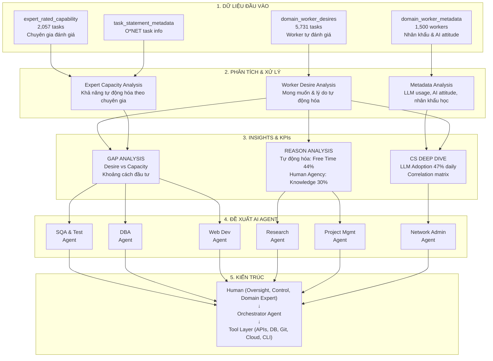

# Sơ đồ luồng: Từ phân tích dữ liệu đến khuyến nghị AI Agent

## Giải thích luồng

| Tầng | Mô tả |
|------|-------|
| **1. Dữ liệu đầu vào** | 4 bộ CSV được load và xử lý song song |
| **2. Phân tích & Xử lý** | 3 nhánh phân tích độc lập: Worker Desire, Expert Capacity, Metadata |
| **3. Insights & KPIs** | Tổng hợp thành các chỉ số chính: Gap, Reason Analysis, CS Deep Dive |
| **4. Đề xuất** | 6 AI Agent được đề xuất dựa trên gap và reason analysis |
| **5. Kiến trúc** | Human-in-the-loop với Orchestrator Agent và Tool Layer |

## Kết nối chính

- **Worker Desire + Expert Capacity → Gap Analysis**: So sánh mong muốn vs khả năng thực tế
- **Gap âm (DBA, Web Dev, Network Support)**: Worker chưa nhận thức đủ → Ưu tiên triển khai
- **Gap dương (Research Scientists, IT Managers)**: Worker muốn nhiều hơn khả năng → Chờ công nghệ
- **Reason Analysis → Proposals 4 & 5**: Free Time & Stress → Research Agent, Project Mgmt Agent
- **CS Deep Dive → Proposal 6**: LLM Adoption cao, repetitive tasks → Network Admin Agent
