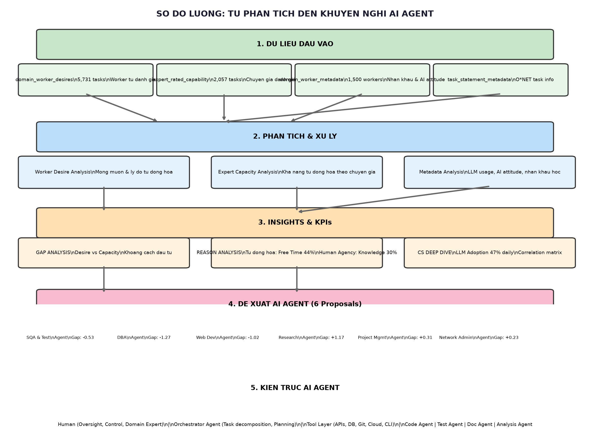

# 🧠 SƠ ĐỒ LUỒNG: TỪ DỮ LIỆU → PHÂN TÍCH → KHUYẾN NGHỊ AI AGENT



---

## 📖 Đọc sơ đồ từ trên xuống dưới

| Tầng | Tên | Mô tả ngắn |
|------|-----|-----------|
| 🟢 **1** | **DỮ LIỆU ĐẦU VÀO** | 4 file CSV: khảo sát worker (5,731 tasks) + chuyên gia (2,057 tasks) |
| 🔵 **2** | **PHÂN TÍCH & XỬ LÝ** | Chia thành 3 nhánh: Worker muốn gì? Chuyên gia nói gì? Worker dùng AI thế nào? |
| 🟠 **3** | **INSIGHTS & KPIs** | Tổng hợp ra: Gap (khoảng cách), Lý do (tại sao muốn/không muốn), Tương quan |
| 🩷 **4** | **ĐỀ XUẤT AI AGENT** | 6 Agent được đề xuất dựa trên số liệu ở tầng 3 |
| 🟣 **5** | **KIẾN TRÚC** | Cách xây dựng: Con người giám sát → AI làm → Công cụ hỗ trợ |

---

## 🎯 Kết quả chính (ai cũng hiểu được)

### 📊 3 phát hiện quan trọng nhất

**1. Worker MUỐN tự động hóa nhất vì:**
```
🕐 Giải phóng thời gian (44%) 
🔄 Công việc lặp lại (29%)
⚠️ Giảm sai sót (29%)
```

**2. Worker KHÔNG muốn giao hẳn cho AI vì:**
```
🧠 Cần kiến thức chuyên môn (30%)
✅ Cần giám sát chất lượng (30%)
🎮 Muốn giữ quyền kiểm soát (28%)
```

**3. Có 2 loại "khoảng cách" (GAP):**
```
⬅️ GAP ÂM: Worker chưa biết AI làm được nhiều thế → Ưu tiên số 1
   - Database Admin: người muốn 2.5, AI làm được 3.8 (gap -1.27)
   - Web Developer: người muốn 3.1, AI làm được 4.1 (gap -1.02)

➡️ GAP DƯƠNG: Worker muốn nhưng AI chưa đủ giỏi → Cần chờ
   - Research Scientists: người muốn 3.8, AI chỉ được 2.6 (gap +1.17)
```

---

## 🚀 6 AI Agent đề xuất (ưu tiên từ cao đến thấp)

| # | AI Agent | Làm gì? | Mức ưu tiên |
|---|----------|---------|------------|
| 1 | **Database Admin Agent** 🗄️ | Tự động tối ưu câu lệnh SQL, backup, phát hiện lỗi | 🔥 Cao nhất (gap -1.27) |
| 2 | **Web Dev Agent** 🌐 | Tự viết code từ bản vẽ, tự động kiểm tra code | 🔥 Cao (gap -1.02) |
| 3 | **Network Admin Agent** 🌍 | Tự sửa lỗi mạng, phát hiện xâm nhập | 🔥 Cao (gap +0.23) |
| 4 | **SQA & Test Agent** ✅ | Tự động kiểm tra lỗi phần mềm | 🔥 Cao (gap -0.53) |
| 5 | **Research Agent** 🔬 | Tự tìm kiếm tài liệu, thiết kế thí nghiệm | ⏳ Cần chờ (gap +1.17) |
| 6 | **Project Mgmt Agent** 📋 | Tự lập kế hoạch, báo cáo tiến độ | ⏳ Cần chờ (gap +0.31) |

---

## 🏗️ Cách AI Agent hoạt động

```
┌──────────────────────────────────────┐
│          CON NGƯỜI (GIÁM SÁT)         │
│  • Kiểm tra chất lượng đầu ra        │
│  • Quyết định cuối cùng              │
│  • Nhập kiến thức chuyên môn         │
└──────────────┬───────────────────────┘
               │ Phê duyệt / Góp ý
               ▼
┌──────────────────────────────────────┐
│         ORCHESTRATOR AGENT            │
│  • Nhận yêu cầu → Chia nhỏ công việc │
│  • Gọi đúng Agent cho từng việc      │
│  • Báo cáo kết quả về cho người      │
└──┬────┬────┬────┬────┬────┬──────────┘
   │    │    │    │    │    │
   ▼    ▼    ▼    ▼    ▼    ▼
 📝  🗄️  🌐  ✅  🔬  📋
 CODE  DB  WEB TEST RESEARCH PM
 AGENT AGENT AGENT AGENT AGENT AGENT
   │    │    │    │    │    │
   └────┴────┴────┴────┴────┘
               │
               ▼
┌──────────────────────────────────────┐
│     CÔNG CỤ (Tool Layer)             │
│  API • Database • Git • Cloud • CLI  │
└──────────────────────────────────────┘
```

---

> **Tóm lại:** Dựa trên khảo sát 5,731 tasks và đánh giá của chuyên gia, chúng tôi đề xuất 6 AI Agent giúp giảm tải công việc lặp lại, giải phóng thời gian cho người làm CNTT tập trung vào việc quan trọng hơn. **Database Admin Agent** và **Web Dev Agent** là 2 ưu tiên cao nhất vì AI đã đủ giỏi nhưng người dùng chưa biết.
